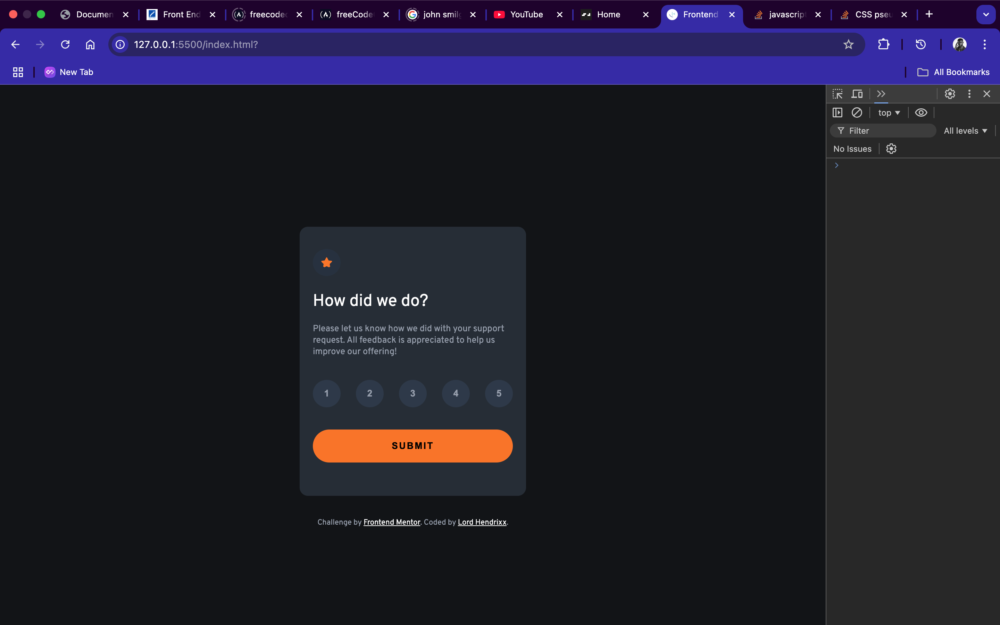

# Frontend Mentor - Interactive rating component solution

This is a solution to the [Interactive rating component challenge on Frontend Mentor](https://www.frontendmentor.io/challenges/interactive-rating-component-koxpeBUmI). Frontend Mentor challenges help you improve your coding skills by building realistic projects. 

## Table of contents

- [Overview](#overview)
  - [The challenge](#the-challenge)
  - [Screenshot](#screenshot)
  - [Links](#links)
- [My process](#my-process)
  - [Built with](#built-with)
  - [What I learned](#what-i-learned)
  - [Continued development](#continued-development)
  - [Useful resources](#useful-resources)
- [Author](#author)
- [Acknowledgments](#acknowledgments)

## Overview

### The challenge

Users should be able to:

- View the optimal layout for the app depending on their device's screen size
- See hover states for all interactive elements on the page
- Select and submit a number rating
- See the "Thank you" card state after submitting a rating

### Screenshot

### Links

- Solution URL: [Vercel](https://your-solution-url.com)
- Live Site URL: [Live Site](http://127.0.0.1:5500/index.html?)

## My process

### Built with

- Semantic HTML5 markup
- CSS custom properties
- Flexbox
- CSS Grid
- Mobile-first workflow
- Javascript

### What I learned

- DOM Manipulation.
- Interactivity with JS.
- Functions.

### Continued development

Deeper we go into the world of javascript.

### Useful resources

- [W3 SCHOOLS](https://www.w3schools.com) - I found really good documentation and guide here.
- [Stack Overflow](https://www.stackoverflow.com) - Nothing beats a community of like minded developers.

## Author
- Frontend Mentor - [Lord Hendrixx](https://www.frontendmentor.io/profile/beeAlmighty)
- Twitter - [Maduakonam Moses](https://www.twitter.com/Maduakonam67451)

## Acknowledgments

I'd like to Thank W3 schools for their support and guidance through their documentation.
